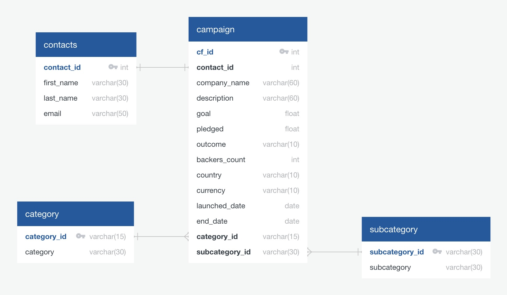

# Crowdfunding_ETL
This ETL project is divided into the following subsections:

- Create the Category and Subcategory DataFrames
- Create the Campaign DataFrame
- Create the Contacts DataFrame
- Create the Crowdfunding Database

#### Create the Category and Subcategory DataFrames

- Extract and transform the "crowdfunding.xlsx" Excel data to create a category DataFrame that has the following columns:
    - A "category_id" column that has entries going sequentially from "cat1" to "catn", where n is the number of unique categories.
    - A "category" column that contains only the category titles.
- Export the category DataFrame as category.csv.
- Extract and transform the "crowdfunding.xlsx" Excel data to create a subcategory DataFrame that has the following columns:
    - A "subcategory_id" column that has entries going sequentially from "subcat1" to "subcatn", where n is the number of unique subcategories.
    - A "subcategory" column that contains only the subcategory titles.
- Export the subcategory DataFrame as subcategory.csv.

#### Create the Campaign DataFrame

- Extract and transform the "crowdfunding.xlsx" Excel data to create a campaign DataFrame.
    - The "goal" column, converted to the float data type.
    - The "pledged" column, converted to the float data type.
    - The "launched_at" column, renamed to "launch_date" and with the UTC times converted to the datetime format.
    - The "deadline" column, renamed to "end_date" and with the UTC times converted to the datetime format.
    - The "category_id" column, with unique identification numbers matching those in the "category_id" column of the category DataFrame.
    - The "subcategory_id" column, with the unique identification numbers matching those in the "subcategory_id" column of the subcategory DataFrame.
- Export the campaign DataFrame as campaign.csv

#### Create the Contacts DataFrame

- Import the contacts.xlsx file into a DataFrame.
- Iterate through the DataFrame, converting each row to a dictionary.
- Iterate through each dictionary, doing the following:
    - Extract the dictionary values from the keys by using a Python list comprehension.
    - Add the values for each row to a new list.
- Create a new DataFrame that contains the extracted data.
- Split each "name" column value into a first and last name, and place each in a new column.
- Clean and export the DataFrame as contacts.csv.

#### Create the Crowdfunding Database

- Inspect the four CSV files, and then sketch an ERD of the tables.

- Use the information from the ERD to create a table schema for each CSV file.
- Save the database schema as a Postgres file named crowdfunding_db_schema.sql.
- Create a new Postgres database, named crowdfunding_db.
- Using the database schema, create the tables in the correct order to handle the foreign keys.
- Import each CSV file into its corresponding SQL table.
